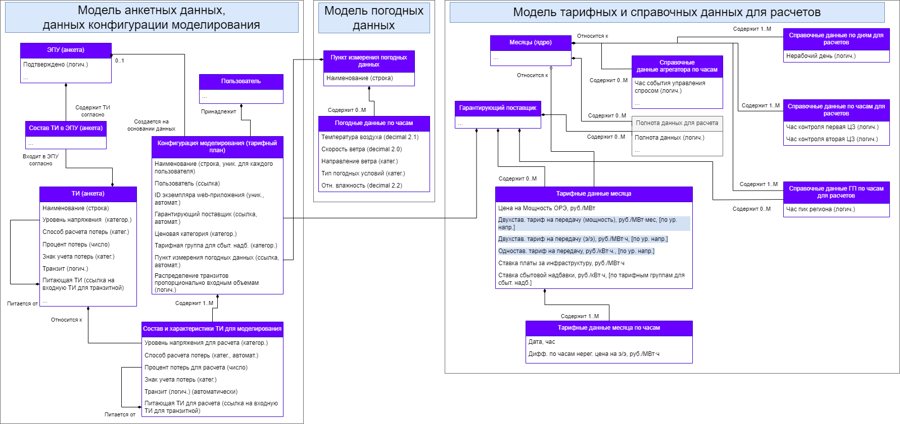
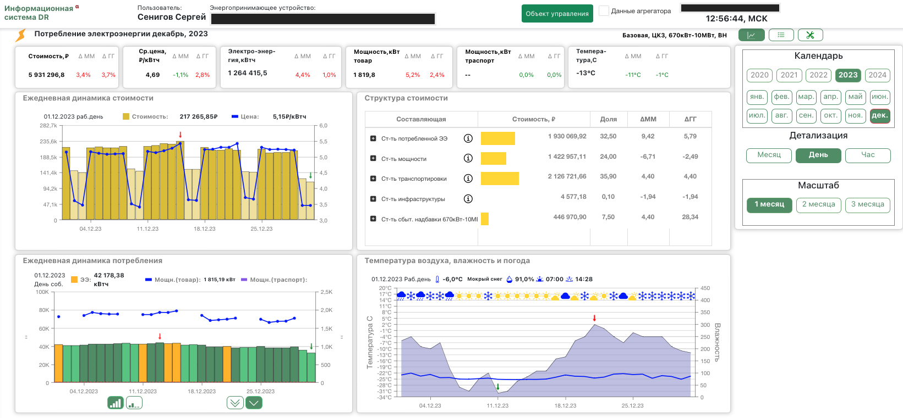

## Дашборд аналитики данных энергопотребления  

Аналитические дашборды потребления электроэнергии

| Задачи                   | Результаты |
| :-------------------- | :--------------------- |
| Создать DWH и процесс ETL, витрины и дашборд на данных в ClickHouse  | Изучил данные из разных источников и автоматизировал их загрузку в хранилище

 Разработал хранилище данных на основе ClickHouse 

 Собрал дашборд в DataLens для визуализации и мониторинга 

 |

<!-- ## Реализация -->
### Модель данных системы для аналитики энергопотребления  

### Визуальный интерфейс дашборда аналитики данных энергопотребления  
